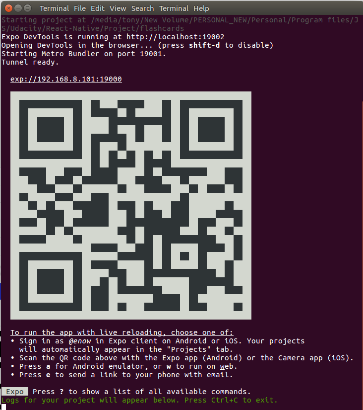
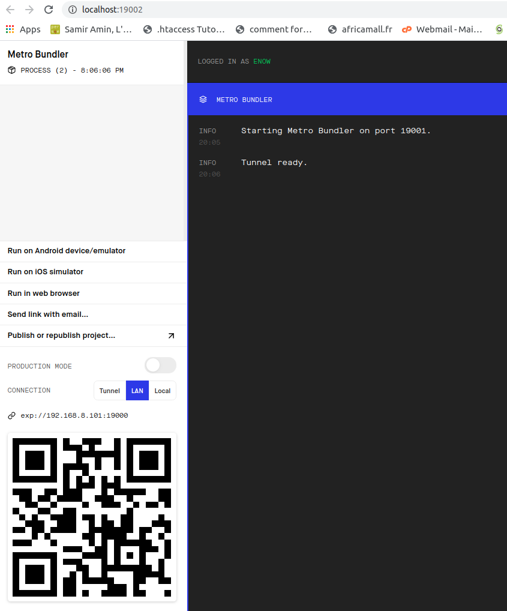
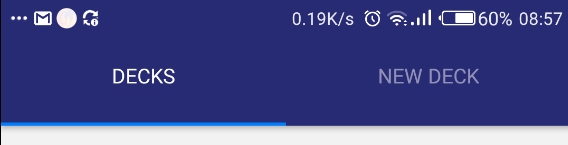
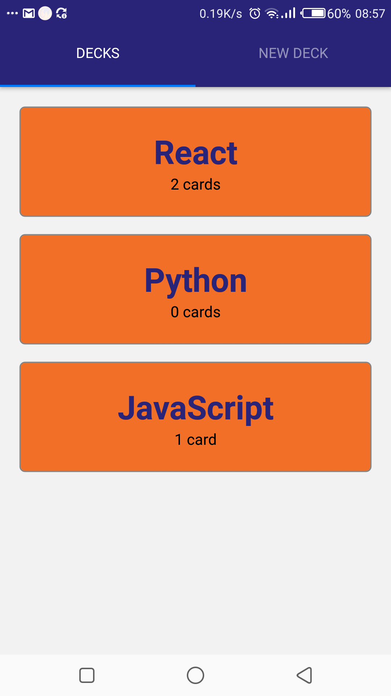
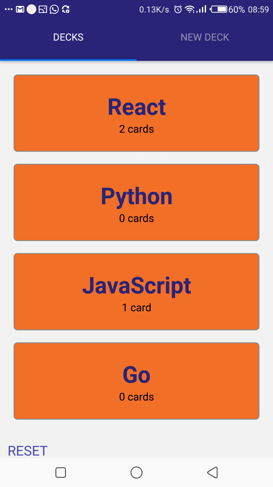
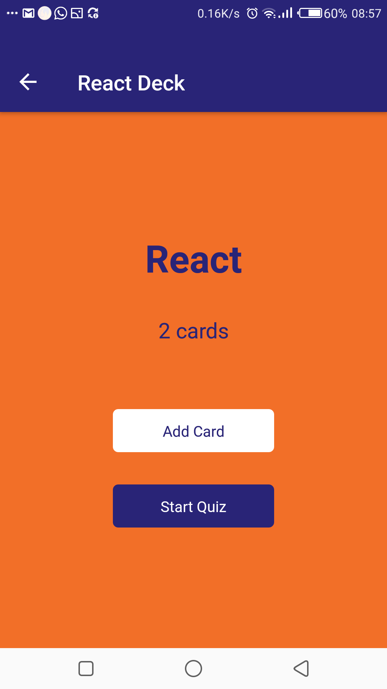
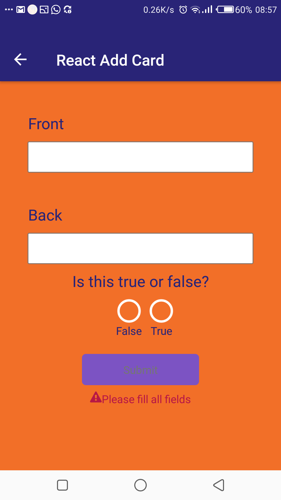
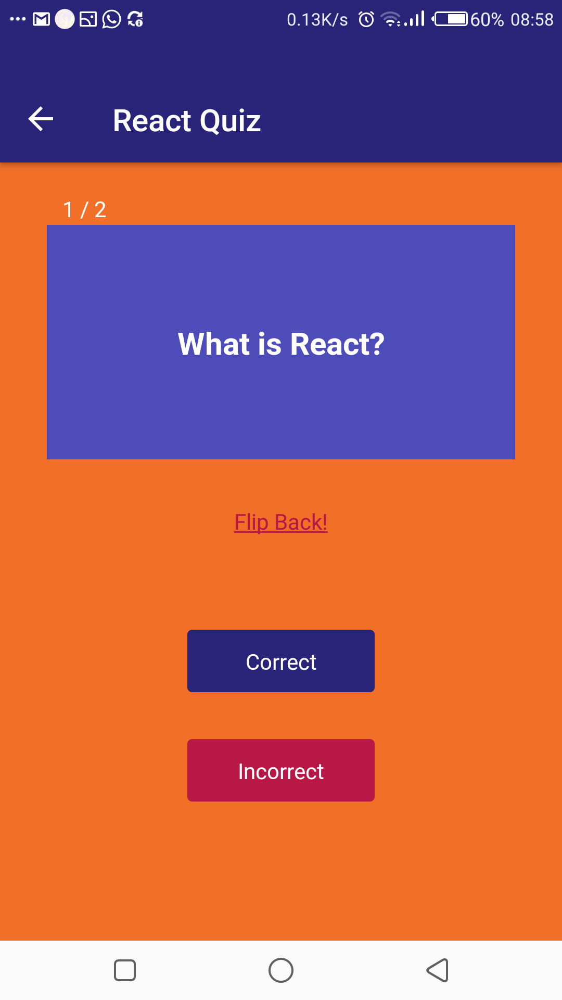
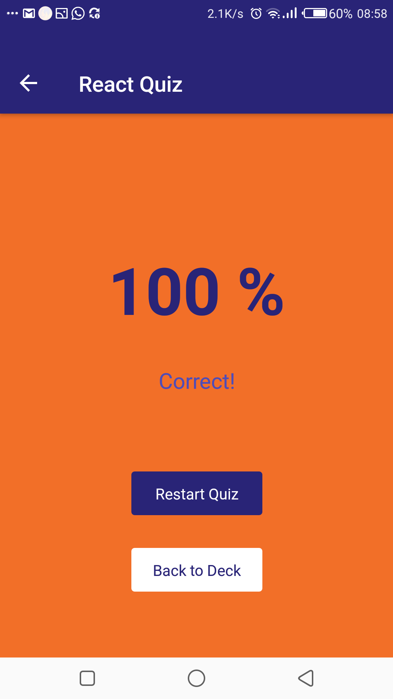

# Udacity ReactND 
## React Native/Redux App - Mobile Flashcards 

### Description
This is a mobile app that allows users to study collections of flashcards. The app will allow users to create different categories of flashcards called "decks", add flashcards to thos decks called "cards", then take quizzes on those deck's cards.
>> The App was tasted on Android mobile phones. 

### How to Install
In your terminal, enter the commands below
```
$ https://github.com/Eyongkevin/reactnd-Flashcards.git

$ cd reactnd-Flashcards

$ yarn install

$ yarn start OR $ expo start
```
### How to run
To run/test this app, you will need either a simulator or a mobile device. The best way will be to install Expo App on your mobile device. Follow the link bellow to install Expo on your device.

[Expo on App Store](https://apps.apple.com/us/app/expo-client/id982107779) - iOS

[Expo on Google Play](https://play.google.com/store/apps/details?id=host.exp.exponent) - android

Then, `cd` to the root directory of this project and run   `expo start`.
 After running this command, you will see the outcome below:
 
1.  From Terminal


Next, run Expo on your phone and use it to scan the `QR code` to open the app on your phone. Or, press `a` for run on an Android emulator if you have it installed already.

1. From Web


Your browser may automatically open this Metor bundler webpage with some few details as shown in the image above. It presents you will various options to run the project.

### How it works
I will describe how this app works base on testing it on an Android mobile device. 

#### Nav


The navigation has two elements `Decks` and `New Deck`. I will explain each element in detail.

#### Decks 
The Decks navigator has the following views.
##### Deck List


This is the home view of the app. It shows a list of Decks which you can navigate to add more cards and take quizzes.

At the start of the app, the `deck list` will display 3 default decks. However, if the user starts adding decks, a button called `RESET` will appear at the bottom of the page allowing the user to reset back to the default decks.



##### Deck View

This shows the deck detail like 

    - Title
    - Number of cards 
    - Options to add new cards and take a quiz

The button `Start Quiz` is only enabled if there are cards in the deck. So, If there is no card in the deck, a warning message will be displayed "**Add card before you can start quiz**" which reminds you to add cards into the deck.

##### Add Card 


Pressing the `Add Card` button from the `Deck View` will redirect you to the view where you can add a card. A card should have a 

    - Front: Which represents the question
    - Back: Which represents the answer
    - RadioButton: Which allows you to select if the provided anwer is true of false.

The `Submit` is only enabled if all fields have been filed. Else, a warning message will be displayed "**Please fill all fields**"

Submitting a card will redirect you to the `Deck View` with the number of cards now available in the deck.

##### Quiz


This is where the user can take his quiz for the deck. It starts off with the first card, showing the Front of the card(Question) allowing the user to press the `Flip Back` button to show the Back of the card(Answer). Now the user can decide if the answer is `correct` or `incorrect` by pressing the corresponding buttons.

After the user has answered all the cards, a score will be displayed to show the user how well he has done in the quiz. The user can then decide to either restart the quize or go back to the `deck view`



>>A notification system is set to remind the user exactly at 8pm every day to take a quiz for the day. The notification is reset if a user takes a quiz.

#### New Deck

This section allows the user to add a new deck. The only requirement to crete a new deck is the deck's name or title. Any deck created here will be displayed in the `deck list` section.
>>The create deck button is only enabled once there is text in the input field.

### Issues encountered
#### Issues with React-Navigation
In this project, I used react-navigation v5. Which is different from what is explained in the course. It was installed with `yarn` but in other to install its dependencies like `react-native-reanimated`,` react-native-gesture-handler`,` react-native-screens`,` react-native-safe-area-context`,` @react-native-community/masked-view`, we need to do it with `expo install`. The reason been that expo will install compatible versions. Otherwise, you might get the error `Some of your project's dependencies are not compatible with currently installed expo package version`. 

Check my contribution and discussion [here](https://github.com/udacity/reactnd-UdaciFitness-complete/commit/9ff26370e4e5593195fdcad4d85e74f540a39220)

#### Render in browser
It was very important that I render in browser so that I can use `console.log` to debug the app. Also, I set up a logger middleware to help me view each action and states once an action is dispatched. It was only possible with a verion of `expo-cli` of `3.18` and above. So, to upgrade, run the command `npm install -g expo-cli`.

Also, I had to close firefox before I could render on chrome. It is weird but worth mentioning.

#### Issues with AsyncStorage
My app displays some initial decks because I have hard-code some initial decks in the `utils/api.js` file
```
const decks = {
    React: {
        title: 'React',
        questions: [
        {
            question: 'What is React?',
            answer: 'A library for managing user interfaces',
            correctAns: 'true'
        },
        {
            question: 'Where do you make Ajax requests in React?',
            answer: 'The componentDidMount lifecycle event',
            correctAns: 'true'
        }
        ]
    },
    Python: {
        title: 'Python',
        questions: []
    },
    JavaScript: {
        title: 'JavaScript',
        questions: [
        {
            question: 'What is a closure?',
            answer: 'The combination of a function and the lexical environment within which that function was declared.',
            correctAns: 'true'
        }
        ]
    }  
};

```
After running the app for the first time, the AsyncStorage maintain the data that it was initialized with even after restarting the expo. So, if you modify the `api.js` with new decks, the app won't read it. It will instead read the data it read when it was first ran. To solve this, you should run `AsyncStorage.removeItem(DECK_STORAGE)` to clear the storage.


### Resources
[expo](https://docs.expo.io)

[react-navigation v5](https://reactnavigation.org/docs/getting-started)

[Layout with Flexbox](https://reactnative.dev/docs/flexbox)
